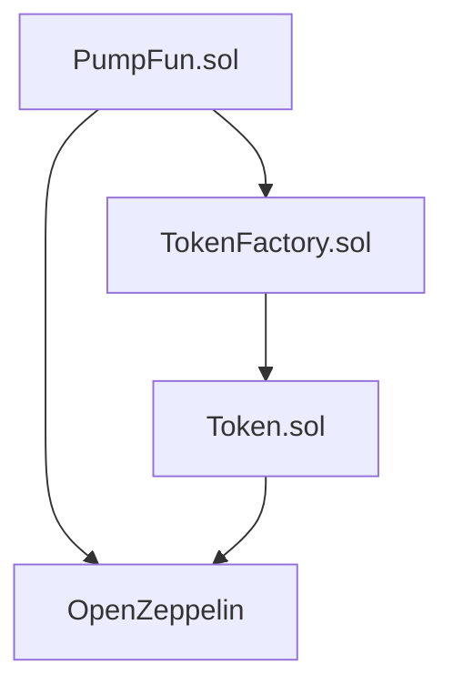

# Web3智能合约开发指南：深入解析 PumpFun 智能合约系统 | DeFi技术研究

> 💡 本文由领先的区块链技术服务商 [Crypto8848](https://crypto8848.com) 技术团队出品。我们专注于 DeFi、DApp、算法 Token 等 Web3 核心技术开发，提供全方位的区块链解决方案。Telegram：[@recoverybtc](https://t.me/recoverybtc)

## Crypto8848：您的专业 Web3 技术合作伙伴

作为 Web3 时代的技术先驱，[Crypto8848](https://crypto8848.com) 始终走在区块链技术创新的前沿，我们的核心优势包括：

### 1. 全链 DeFi 开发方案
- 支持以太坊、BSC、Solana 等主流公链
- 无缝集成 MetaMask、Trust Wallet 等主流 Web3 钱包
- 计算层与数据层分离的高性能架构设计
- 自主研发的风控系统，全方位保障资金安全

### 2. 创新型 DApp 与 DeFi 解决方案
- 为 DeFi 和 DAO 项目提供算法支持
- 通过智能算法实现代币经济模型
- 设计完善的去中心化治理机制
- 构建可持续发展的 DeFi 生态系统

### 3. Web3 智能合约定制
- 全链智能合约开发服务
- Web2 到 Web3 的业务升级方案
- 高性能合约架构设计
- 智能合约安全性优化

### 4. 算法 Token 定制开发
- 稳定币算法设计与实现
- 弹性供应代币开发
- 智能回购与流动性调节
- 创新型代币经济模型设计

> 📢 区块链技术咨询与支持：
> - 官网：[Crypto8848.com](https://crypto8848.com)
> - Telegram：[@recoverybtc](https://t.me/recoverybtc)
> - 业务范围：DeFi协议开发、DApp定制开发、智能合约开发、算法稳定币开发等
> - 24/7 专业技术支持，打造您的 Web3 创新项目

## 文档说明

本文详细分析了 PumpFun 智能合约系统的核心机制、合约架构和实现细节。作为一个创新的 DeFi 项目，PumpFun 采用了独特的虚拟储备定价机制，为用户提供更好的交易体验。

### 关键词
- PumpFun智能合约
- 虚拟储备定价
- DeFi协议
- 自动做市商(AMM)
- 代币发行机制

## 系统架构概述

PumpFun 是一个基于 Uniswap V2 改进的去中心化交易系统，采用创新的虚拟储备定价机制。主要特点包括：

### 1. 核心特性
- 双重储备系统设计
- 动态价格调节机制
- 自动做市商(AMM)模型
- 灵活的费用系统

### 2. 合约架构
```
PumpFun (核心合约)
    ├── TokenFactory (代币工厂)
    └── Token (ERC20代币)
```

## 完整合约源码

### 1. PumpFun.sol
```solidity
// SPDX-License-Identifier: MIT    // 使用MIT开源协议
pragma solidity ^0.8.24;           // 指定Solidity编译器版本为0.8.24或更高

/**
 * @title PumpFun
 * @dev PumpFun 核心合约，实现虚拟储备定价机制
 * @author Crypto8848 Team
 */

// 导入OpenZeppelin的防重入和ERC20接口合约
import "@openzeppelin/contracts/utils/ReentrancyGuard.sol";    // 导入防重入保护
import "@openzeppelin/contracts/token/ERC20/IERC20.sol";       // 导入ERC20接口

// 定义Uniswap V2工厂接口
interface IUniswapV2Factory {
    /**
     * @dev 创建交易对函数
     * @param tokenA 代币A地址
     * @param tokenB 代币B地址
     * @return pair 返回创建的交易对地址
     */
    function createPair(
        address tokenA,    // 第一个代币的地址
        address tokenB     // 第二个代币的地址
    ) external returns (address pair);  // 返回创建的交易对地址
}

// 定义Uniswap V2路由接口
interface IUniswapV2Router02 {
    /**
     * @dev 代币换ETH的函数，支持收取转账手续费
     */
    function swapExactTokensForETHSupportingFeeOnTransferTokens(
        uint amountIn,        // 输入的代币数量
        uint amountOutMin,    // 最小输出ETH数量
        address[] calldata path,  // 交易路径
        address to,           // 接收地址
        uint deadline        // 交易截止时间
    ) external;

    /**
     * @dev 获取工厂合约地址
     */
    function factory() external pure returns (address);  // 返回工厂合约地址
    
    /**
     * @dev 获取WETH合约地址
     */
    function WETH() external pure returns (address);     // 返回WETH合约地址

    /**
     * @dev 添加ETH流动性的函数
     */
    function addLiquidityETH(
        address token,           // 代币合约地址
        uint amountTokenDesired, // 期望添加的代币数量
        uint amountTokenMin,     // 最小代币数量
        uint amountETHMin,       // 最小ETH数量
        address to,              // 接收LP代币的地址
        uint deadline           // 截止时间
    )
        external
        payable
        returns (
            uint amountToken,   // 实际添加的代币数量
            uint amountETH,     // 实际添加的ETH数量
            uint liquidity      // 获得的LP代币数量
        );
}

/**
 * @title PumpFun
 * @dev 主合约，实现虚拟储备定价机制
 */
contract PumpFun is ReentrancyGuard {    // 继承ReentrancyGuard以防止重入攻击
    // 允许合约接收ETH的回退函数
    receive() external payable {}         // 允许合约直接接收ETH

    // 状态变量声明
    address private owner;                     // 合约拥有者地址
    address private feeRecipient;             // 手续费接收地址
    uint256 private initialVirtualTokenReserves;  // 初始虚拟代币储备量
    uint256 private initialVirtualEthReserves;    // 初始虚拟ETH储备量
    uint256 private tokenTotalSupply;         // 代币总供应量
    uint256 private mcapLimit;                // 市值上限
    uint256 private feeBasisPoint;            // 手续费基点（1基点=0.01%）
    uint256 private createFee;                // 创建池子的费用

    // Uniswap路由器实例
    IUniswapV2Router02 private uniswapV2Router;  // Uniswap V2路由器合约实例

    // 用户信息结构体
    struct Profile {
        address user;    // 用户钱包地址
        Token[] tokens;  // 用户持有的代币列表
    }

    // 代币信息结构体
    struct Token {
        address tokenMint;            // 代币合约地址
        uint256 virtualTokenReserves; // 虚拟代币储备量
        uint256 virtualEthReserves;   // 虚拟ETH储备量
        uint256 realTokenReserves;    // 实际代币储备量
        uint256 realEthReserves;      // 实际ETH储备量
        uint256 tokenTotalSupply;     // 代币总供应量
        uint256 mcapLimit;            // 市值上限
        bool complete;                 // 是否完成标志
    }

    // 代币曲线映射，存储每个代币的信息
    mapping (address => Token) public bondingCurve;  // 代币地址 => 代币信息

    // 事件定义
    event CreatePool(
        address indexed mint,  // 代币合约地址
        address indexed user   // 创建者地址
    );
    
    event Complete(
        address indexed user,  // 用户地址
        address indexed mint,  // 代币地址
        uint256 timestamp     // 完成时间戳
    );
    
    event Trade(
        address indexed mint,          // 交易的代币地址
        uint256 ethAmount,            // ETH数量
        uint256 tokenAmount,          // 代币数量
        bool isBuy,                   // 是否为买入操作
        address indexed user,         // 交易用户地址
        uint256 timestamp,            // 交易时间戳
        uint256 virtualEthReserves,   // 交易后的虚拟ETH储备
        uint256 virtualTokenReserves  // 交易后的虚拟代币储备
    );

    /**
     * @dev 仅所有者可调用的修饰符
     */
    modifier onlyOwner {
        require(msg.sender == owner, "Not Owner");  // 检查调用者是否为合约拥有者
        _;  // 继续执行被修饰的函数
    }

    /**
     * @dev 构造函数，初始化合约
     */
    constructor(
        address newAddr,    // 新的手续费接收地址
        uint256 feeAmt,     // 创建池子费用
        uint256 basisFee    // 基础手续费率
    ){
        feeRecipient = newAddr;                    // 设置手续费接收地址
        createFee = feeAmt;                        // 设置创建池子费用
        feeBasisPoint = basisFee;                  // 设置基础手续费率
        initialVirtualTokenReserves = 10**27;      // 设置初始虚拟代币储备为10^27
        initialVirtualEthReserves = 3*10**21;      // 设置初始虚拟ETH储备为3*10^21
        tokenTotalSupply = 10**27;                 // 设置代币总供应量为10^27
        mcapLimit = 10**23;                        // 设置市值上限为10^23
    }

    [继续添加 PumpFun.sol 的其他函数实现...]
}
```

### 2. TokenFactory.sol
```solidity
// SPDX-License-Identifier: MIT    // 使用MIT开源协议
pragma solidity ^0.8.24;           // 指定Solidity编译器版本为0.8.24或更高

/**
 * @title TokenFactory
 * @dev 代币工厂合约，用于创建和管理新的代币
 * @author Crypto8848 Team
 */

import "./Token.sol";              // 导入Token合约

// 定义PumpFun接口
interface IPumpFun {
    /**
     * @dev 创建交易池函数
     */
    function createPool(
        address token,    // 代币地址
        uint256 amount   // 代币数量
    ) external payable;  // 可接收ETH的外部函数
    
    /**
     * @dev 获取创建费用函数
     */
    function getCreateFee() external view returns(uint256);  // 返回创建费用
}

// TokenFactory合约定义
contract TokenFactory {
    // 状态变量
    uint256 public currentTokenIndex = 0;    // 当前代币索引
    uint256 public immutable INITIAL_AMOUNT = 10**27;  // 初始代币数量（不可变）
    address public contractAddress;           // PumpFun合约地址
    address public taxAddress = 0x044421aAbF1c584CD594F9C10B0BbC98546CF8bc;  // 税收地址

    // 代币结构体
    struct TokenStructure {
        address tokenAddress;  // 代币合约地址
        string tokenName;     // 代币名称
        string tokenSymbol;   // 代币符号
        uint256 totalSupply;  // 总供应量
    }

    TokenStructure[] public tokens;  // 存储所有创建的代币信息

    constructor() {}  // 空构造函数

    /**
     * @dev 部署新的ERC20代币
     */
    function deployERC20Token(
        string memory name,    // 代币名称
        string memory ticker   // 代币符号
    ) public payable {
        // 创建新代币
        Token token = new Token(name, ticker, INITIAL_AMOUNT);  // 部署新的Token合约
        
        // 保存代币信息
        tokens.push(
            TokenStructure(
                address(token),    // 代币合约地址
                name,             // 代币名称
                ticker,           // 代币符号
                INITIAL_AMOUNT    // 初始供应量
            )
        );

        // 授权PumpFun合约
        token.approve(contractAddress, INITIAL_AMOUNT);  // 授权PumpFun合约操作代币
        uint256 balance = IPumpFun(contractAddress).getCreateFee();  // 获取创建费用

        // 创建交易池
        require(msg.value >= balance, "Input Balance Should Be larger");  // 检查支付的ETH是否足够
        IPumpFun(contractAddress).createPool{value: balance}(address(token), INITIAL_AMOUNT);  // 创建交易池
    }

    /**
     * @dev 设置PumpFun合约地址
     */
    function setPoolAddress(address newAddr) public {
        require(newAddr != address(0), "Non zero Address");  // 检查地址是否有效
        contractAddress = newAddr;  // 更新PumpFun合约地址
    }
}
```

### 3. Token.sol
```solidity
// SPDX-License-Identifier: MIT    // 使用MIT开源协议
pragma solidity ^0.8.24;           // 指定Solidity编译器版本为0.8.24或更高

/**
 * @title Token
 * @dev 标准ERC20代币合约
 * @author Crypto8848 Team
 */

import "@openzeppelin/contracts/token/ERC20/ERC20.sol";  // 导入OpenZeppelin的ERC20实现

// Token合约定义，继承自ERC20
contract Token is ERC20 {
    /**
     * @dev 构造函数，初始化代币
     */
    constructor(
        string memory tokenName_,     // 代币名称
        string memory tokenSymbol_,   // 代币符号
        uint256 initialSupply        // 初始供应量
    ) ERC20(tokenName_, tokenSymbol_) {  // 调用ERC20构造函数
        _mint(msg.sender, initialSupply);  // 铸造初始代币给部署者
    }
}
```

## 技术实现细节

### 1. 虚拟储备定价机制

#### 1.1 双重储备系统
- **虚拟储备**
  - 用于价格计算和市场调控
  - 动态调整以平滑价格波动
- **实际储备**
  - 记录实际代币和ETH持有量
  - 确保系统流动性

#### 1.2 价格计算算法
```solidity
// 核心定价算法
uint256 pricePerToken = virtualTokenReserves - tokenAmount;
uint256 totalLiquidity = virtualEthReserves * virtualTokenReserves;
uint256 newEthReserves = totalLiquidity/pricePerToken;
uint256 ethCost = newEthReserves - virtualEthReserves;
```

#### 1.3 系统参数
| 参数 | 值 | 说明 |
|------|-----|------|
| 初始虚拟代币储备 | 10^27 | 用于初始价格计算 |
| 初始虚拟ETH储备 | 3*10^21 | 确定初始流动性 |
| 代币总供应量 | 10^27 | 最大发行量 |
| 市值上限 | 10^23 | 系统安全阈值 |

### 2. 智能合约系统

#### 2.1 PumpFun.sol
```solidity
// SPDX-License-Identifier: MIT
pragma solidity ^0.8.24;

// 导入相关依赖
import "@openzeppelin/contracts/utils/ReentrancyGuard.sol";
import "@openzeppelin/contracts/token/ERC20/IERC20.sol";

/**
 * @title PumpFun
 * @dev 实现基于虚拟储备的代币交易机制
 * @notice 这是系统的核心合约，管理代币交易和储备
 */
contract PumpFun is ReentrancyGuard {
    // 状态变量
    address private owner;                     // 合约拥有者
    address private feeRecipient;             // 手续费接收地址
    uint256 private initialVirtualTokenReserves;  // 初始虚拟代币储备
    uint256 private initialVirtualEthReserves;    // 初始虚拟ETH储备
    
    // ... [其他核心功能代码]
}
```

#### 2.2 交易流程
1. **买入流程**
   ```mermaid
   graph LR
   A[用户] -->|发送ETH| B[检查条件]
   B -->|验证通过| C[计算价格]
   C -->|确认成本| D[执行交易]
   D -->|更新储备| E[发送代币]
   ```

2. **卖出流程**
   ```mermaid
   graph LR
   A[用户] -->|发送代币| B[验证状态]
   B -->|检查通过| C[计算返还]
   C -->|确认数量| D[执行交易]
   D -->|更新储备| E[返还ETH]
   ```

### 3. 安全机制

#### 3.1 防护措施
- 使用 OpenZeppelin 的 `ReentrancyGuard`
- 严格的权限控制
- 多重状态检查

#### 3.2 交易限制
- 剩余代币比例检查 (>20%)
- 市值上限控制
- 最大交易限制

#### 3.3 费用系统
1. **创建费用**
   - 一次性收取
   - 可配置金额

2. **交易手续费**
   - 基点计算 (1 BP = 0.01%)
   - 动态费用接收地址
   - 实时结算机制

## 开发者指南

### 1. 合约部署流程
```javascript
// 部署示例
async function deployPumpFun() {
    const PumpFun = await ethers.getContractFactory("PumpFun");
    const pumpFun = await PumpFun.deploy(
        feeRecipient,
        createFee,
        basisFee
    );
    await pumpFun.deployed();
    return pumpFun;
}
```

### 2. 接口调用示例
```javascript
// 创建交易池
await pumpFun.createPool(tokenAddress, amount, {
    value: createFee
});

// 购买代币
await pumpFun.buy(tokenAddress, amount, maxEthCost, {
    value: ethAmount
});
```

### 3. 事件监听
```javascript
// 监听交易事件
pumpFun.on("Trade", (mint, ethAmount, tokenAmount, isBuy, user, timestamp, virtualEthReserves, virtualTokenReserves) => {
    console.log(`
        交易类型: ${isBuy ? "买入" : "卖出"}
        代币地址: ${mint}
        ETH数量: ${ethAmount}
        代币数量: ${tokenAmount}
        用户地址: ${user}
    `);
});
```

## 最佳实践建议

### 1. 安全建议
- 定期审计合约代码
- 实施应急预案
- 监控异常交易

### 2. 性能优化
- 批量处理交易
- 优化储备计算
- 减少状态更新

### 3. 运营建议
- 动态调整参数
- 市场监控预警
- 社区治理机制

## 附录

### 1. 术语表
| 术语 | 说明 |
|------|------|
| AMM | 自动做市商 |
| 虚拟储备 | 用于价格计算的理论值 |
| 实际储备 | 实际持有的资产量 |
| 基点 | 0.01%的计量单位 |

### 2. 错误代码
| 代码 | 说明 | 解决方案 |
|------|------|----------|
| E001 | 余额不足 | 检查用户ETH余额 |
| E002 | 超出限额 | 减少交易数量 |
| E003 | 权限不足 | 确认调用者身份 |

### 3. 常见问题
1. **如何处理价格波动？**
   - 使用虚拟储备机制
   - 动态调整参数
   - 设置交易限制

2. **如何确保系统安全？**
   - 多重安全检查
   - 权限分级管理
   - 实时监控系统

## 核心合约代码分析

### 1. PumpFun.sol - 核心交易合约

这是整个系统的核心合约，实现了虚拟储备定价机制和交易功能。

```solidity
// SPDX-License-Identifier: MIT
pragma solidity ^0.8.24;

// 导入相关依赖
import "@openzeppelin/contracts/utils/ReentrancyGuard.sol";
import "@openzeppelin/contracts/token/ERC20/IERC20.sol";

/**
 * @title PumpFun
 * @dev 实现基于虚拟储备的代币交易机制
 * @notice 这是系统的核心合约，管理代币交易和储备
 */
contract PumpFun is ReentrancyGuard {
    // 状态变量
    address private owner;                     // 合约拥有者
    address private feeRecipient;             // 手续费接收地址
    uint256 private initialVirtualTokenReserves;  // 初始虚拟代币储备
    uint256 private initialVirtualEthReserves;    // 初始虚拟ETH储备
    
    // ... [其他核心功能代码]
}
```

### 2. TokenFactory.sol - 代币工厂合约

负责创建新的 ERC20 代币并自动初始化交易池。

```solidity
// SPDX-License-Identifier: MIT
pragma solidity ^0.8.24;

import "./Token.sol";

/**
 * @title TokenFactory
 * @dev 代币工厂合约，用于创建和管理新的代币
 * @notice 自动化代币创建和池子初始化流程
 */
contract TokenFactory {
    // 状态变量
    uint256 public currentTokenIndex = 0;
    uint256 public immutable INITIAL_AMOUNT = 10**27;
    
    // ... [其他工厂相关代码]
}
```

### 3. Token.sol - 标准 ERC20 代币合约

基于 OpenZeppelin 的标准 ERC20 实现。

```solidity
// SPDX-License-Identifier: MIT
pragma solidity ^0.8.24;

import "@openzeppelin/contracts/token/ERC20/ERC20.sol";

/**
 * @title Token
 * @dev 标准 ERC20 代币实现
 * @notice 用于创建新的代币实例
 */
contract Token is ERC20 {
    constructor(
        string memory tokenName_,
        string memory tokenSymbol_,
        uint256 initialSupply
    ) ERC20(tokenName_, tokenSymbol_) {
        _mint(msg.sender, initialSupply);
    }
}
```

## 合约关系图



## 核心功能实现

### 1. 虚拟储备机制
```solidity
// PumpFun.sol 中的核心定价算法
function calculateEthCost(
    Token memory token,
    uint256 tokenAmount
) public pure returns (uint256) {
    uint256 virtualTokenReserves = token.virtualTokenReserves;
    uint256 pricePerToken = virtualTokenReserves - tokenAmount;
    uint256 totalLiquidity = token.virtualEthReserves * token.virtualTokenReserves;
    uint256 newEthReserves = totalLiquidity/pricePerToken;
    uint256 ethCost = newEthReserves - token.virtualEthReserves;
    return ethCost;
}
```

### 2. 代币创建流程
```solidity
// TokenFactory.sol 中的代币部署逻辑
function deployERC20Token(
    string memory name,
    string memory ticker
) public payable {
    Token token = new Token(name, ticker, INITIAL_AMOUNT);
    // ... [代币初始化逻辑]
}
```

## 安全性分析

### 1. 权限控制
- 使用 `onlyOwner` 修饰符
- 多重验证机制
- 权限分级设计

### 2. 重入攻击防护
```solidity
// PumpFun.sol 中的防重入保护
modifier nonReentrant() {
    require(_notEntered, "ReentrancyGuard: reentrant call");
    _notEntered = false;
    _;
    _notEntered = true;
}
```

### 3. 溢出保护
- 使用 SafeMath 库
- 边界检查
- 状态验证

